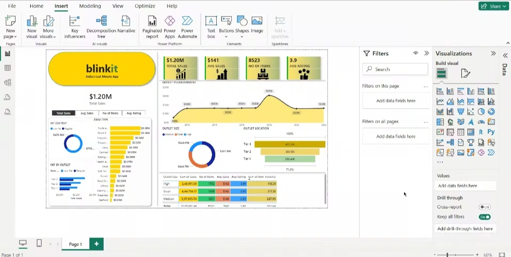

# Blinkit Sales Dashboard (Power BI)

## Project Overview
This dashboard analyzes Blinkit's sales performance, outlet performance, item categories, and customer ratings.

## KPIs
- Total Sales: $1.20M
- Average Sales: $141
- Number of Items: 8523
- Average Rating: 3.9

## Dashboard Insights
- Sales trend by outlet establishment year
- Sales by item type
- Sales by outlet size
- Sales by outlet location
- Fat content analysis

## Tools Used
- Power BI
- Excel/CSV
- DAX

## Dashboard Preview

